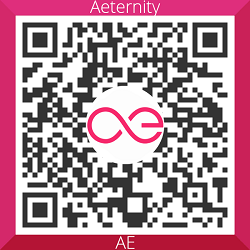

# aepp-sdk-java
A community developed Java SDK to interact with the Æternity blockchain powered by [kryptokrauts.com](https://kryptokrauts.com)!

## Latest release
 

## Documentation

- [How to add the SDK to your project](../../wiki#how-to-add-the-sdk-to-your-project)
- [Access SDK services](../../wiki/Documentation#access-sdk-services)
- [Generate and post a transaction](../../wiki/Documentation#generate-and-post-a-transaction)
- [Generate a HD wallet](../../wiki/Documentation#generate-a-hd-wallet)

## Release notes

- [v1.1.0](docs/release-notes/RELEASE-NOTES-1.1.0.md)
- [v1.0.2](docs/release-notes/RELEASE-NOTES-1.0.2.md)
- [v1.0.1](docs/release-notes/RELEASE-NOTES-1.0.1.md)
- [v1.0.0](docs/release-notes/RELEASE-NOTES-1.0.0.md)

## License

Licensed under the [ISC License](LICENSE)

## Support us

If you like this project we would appreciate your support.

- [ak_5z1fmzTKR1GA1P7qiLDCC1s3V7AK2RRpNbXqUhfHQbUeg7mmV](https://explorer.aepps.com/#/account/ak_5z1fmzTKR1GA1P7qiLDCC1s3V7AK2RRpNbXqUhfHQbUeg7mmV)

(QR-code generated with https://cwaqrgen.com/aeternity)